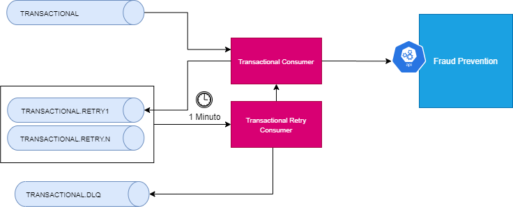

# kafka-retry
Exemplo de implementação do mecanismo de retry utilizando Kafka

<h1 align="center">Kafka Retry</h1>

Descrição
=================

Exemplo de implementação de um micro serviço com mecanismo de retry utilizando kafka utilizando o Spring Boot.

 

  
  
  
  

Índice
=================
<!--ts-->
- [kafka-retry](#kafka-retry)
- [Descrição](#descrição)
- [Índice](#índice)
- [Como Usar](#como-usar)
- [Status](#status)
<!--te-->

Como Usar
=================

#Pré Requesitos
* Java 14
* Docker instalado

#Subindo Aplicação
* Clonar repositório
* Navegar até a pasta do arquivo docker-compose.yml
* Rodar comando <b>docker-compose up -d</b>
* Validar se foi tudo criado e está UP com o comando <b>docker-compose ps</b>
* Abrir os projetos transactional-producer, transactional-retry-consumer e fraud-prevention
* Subir as aplicações através da classe SpringApplication ou RetrySpringApplication

Status
=================
<h4 align="center"> 
	🚧  kafka - Em construção...  🚧
</h4>